Резервная копия — это архив сайта в формате `tar.gz`, который может содержать файлы публичной части, ядро Bitrix Framework и дамп базы данных.

Резервные копии нужны для защиты от потери данных и при переносе сайта на другой хостинг. Всегда создавайте копию перед обновлением ядра или модулей сайта.

## Размещение копий

Резервные копии можно хранить локально на сервере, в облаке 1С-Битрикс или в стороннем облачном хранилище.

### Локальные копии

На сервере копии хранятся в папке `/bitrix/backup/`.

Преимущества варианта:

-  без дополнительных сервисов,

-  бесплатное хранение.

Недостатки:

-  уязвимость к локальным сбоям — отключение электричества, повреждение диска, ошибки администратора,

-  ограниченный объем — зависит от дискового пространства сервера.

Чтобы снизить риск полной потери данных при локальной аварии, копируйте архивы на внешние носители или в другое место вне сервера. Это замедляет восстановление, но повышает надежность.

### Облако 1С-Битрикс

Облако 1С-Битрикс — бесплатное облачное хранилище с шифрованием и поддержкой автоматического резервного копирования.

Для работы с облаком нужны активный коммерческий лицензионный ключ и установленный модуль Облако 1С-Битрикс.



Физическое размещение зависит от страны покупки лицензии:

-  Yandex Object Storage — для лицензий из России, Беларуси и Казахстана.

-  Amazon S3 — для остальных стран.



Объем хранилища зависит от лицензии:

-  1С-Битрикс: Управление сайтом — Старт, Стандарт: 2 ГБ,

-  1С-Битрикс: Управление сайтом — Малый бизнес: 4 ГБ,

-  1С-Битрикс: Управление сайтом — Бизнес: 10 ГБ,

-  1С-Битрикс24 — Интернет-магазин + CRM: 15 ГБ,

-  1С-Битрикс24 — Корпоративный портал: 20 ГБ,

-  1С-Битрикс: Управление сайтом, 1С-Битрикс24 — Энтерпрайз: 60 ГБ.

В облаке хранится не более трех резервных копий. При создании новой копии самая старая удаляется автоматически. Если места не хватает даже для одной копии, система не создает новую копию и не удаляет старые. Операция завершается с ошибкой.

В течение 14 дней после окончания лицензии копии остаются в облаке. Восстановить их можно только с активным лицензионным ключом.

Если сайт удален, восстановить данные из облака можно через техподдержку. В обращении укажите активный лицензионный ключ.

### Сторонние облачные хранилища

Сторонние облачные хранилища подключают через модуль Облачные хранилища.

1. Зарегистрируйте аккаунт у провайдера.

2. Настройте подключение через интерфейс Bitrix Framework.

Объем хранилища зависит от тарифного плана у провайдера. Обычно он больше, чем в облаке 1С-Битрикс.

Хранение копий в стороннем облаке снижает нагрузку на сервер, но требует самостоятельной настройки и оплаты услуг провайдера.

## Создать резервную копию

Резервную копию можно создать на странице *Настройки > Инструменты > Резервное копирование > Создание резервной копии*.



Система создает дамп базы данных только для MySQL. Для PostgreSQL можно архивировать файлы ядра и публичной части, а дамп базы делайте внешними инструментами.



1. Выберите размещение копии: в облаке 1С-Битрикс, локально в папке сайта или в стороннем облаке.

2. Нажмите Создать резервную копию.

   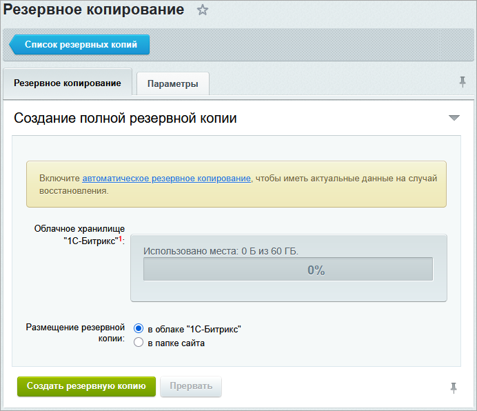{width=692px height=596px}

### Экспертные настройки {#expert}

На вкладке Параметры можно вручную задать настройки резервного копирования.

1. Отметьте опцию *Включить экспертные настройки создания резервной копии*.

   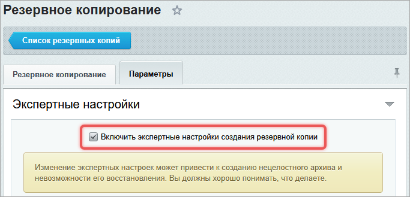{width=683px height=329px}

2. Укажите, что включать в архив.

   -  Архивировать базу данных — сохраняет содержимое MySQL. Обязательно для полного восстановления.

   -  Исключить из базы данных  — исключает из архива статистику, поисковый индекс, журнал событий.

   -  Архивировать ядро — сохраняет ядро. Архивируйте ядро обязательно, если обновления устанавливали давно и не уверены в восстановлении нужной версии.

   -  Архивировать публичную часть — сохраняет все файлы публичной части.

   -  Исключить из архива файлы и директории по маске — позволяет исключить ненужные файлы и папки по маске:

      -  `*` — любое количество символов,

      -  `/` в начале — путь от корня сайта,

      -  без `/` — правило применяется ко всем файлам и папкам.

      Например, `.access.php` — исключить все файлы с этим именем, `/files/download/*.zip` — исключить ZIP-файлы в папке `/files/download`.

   -  Исключить из архива файлы размером более — исключает файлы, которые превышают указанный размер.

   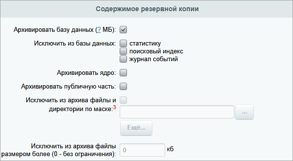{width=600px height=329px}

3. Задайте технические параметры.

   -  Шифровать данные резервной копии — можно отключить для  локальных копий. Для облака 1С-Битрикс всегда включено. Подробности читайте в разделе [Шифрование копий](./backup.md#encrypt).

   -  Проверить целостность архива после завершения — система виртуально распаковывает архив без создания файлов. Это подтверждает, что архив не поврежден.

   -  Отключить компрессию архива — опция позволяет не сжимать архив. Если отключить компрессию, архив занимает больше места и дольше передается в облако или по сети.

   -  Длительность шага — время, за которое система выполняет одну операцию при создании архива. Значение зависит от настроек в `php.ini`. Длительность должна быть не более таймаута веб-сервера — 30 секунд.

   -  Максимальный размер несжатых данных в одной части архива — максимальный размер одного файла архива в мегабайтах. Не устанавливайте больше 200 Мб. Оптимальное значение — 100 Мб. Настройки PHP не позволяют создавать части больше 2 Гб.

4. Нажмите Создать резервную копию.

### Шифрование копий {#encrypt}

Шифрование использует стандартный алгоритм `openssl_encrypt` и защищает данные в резервной копии.

При создании зашифрованной копии система запросит пароль. Рекомендуется использовать пароль длиной не менее 6 символов со спецсимволами.

-  Пароль не сохраняется ни в системе Bitrix Framework, ни в компании 1С-Битрикс.

-  Компания 1С-Битрикс не может восстановить пароль или расшифровать архив.

-  Без пароля восстановить данные невозможно — даже техподдержка не сможет помочь.

-  Для каждой копии можно задать свой пароль.

Резервные копии привязаны к лицензионному ключу. Запись в облако возможна только с оригинальной установки продукта и с одной копии для разработки. Повторный ввод ключа на другом сервере блокирует запись новых копий, что защищает от переполнения хранилища.

### Уменьшить размер архива

Большие архивы быстро заполняют место и усложняют восстановление. Размер архива можно сократить.

-  Не включайте в копию то, что можно пересоздать: поисковый индекс, статистику, журнал событий.

-  Исключите папку с резервными копиями, если храните их не в `/bitrix/backup/`. Это вызовет рекурсию: архив включает сам себя.

-  Уберите временные или дублирующие данные: локальные архивы документов, кеш, загрузки.

-  Ограничьте размер файлов. Большие видео, PDF и изображения лучше хранить отдельно и загружать после восстановления.

Если архив все равно превышает несколько гигабайт, храните его локально.

## Настроить автоматическое копирование

Создание резервных копий можно настроить в автоматическом режиме с помощью скрипта. Без участия пользователя система делает копию один раз в день, через день, каждые три дня или один раз в неделю.

1. Откройте страницу *Настройки > Инструменты > Резервное копирование > Регулярное резервное копирование* и перейдите на вкладку Параметры.

2. Выберите место хранения копии: локально или в облаке.

   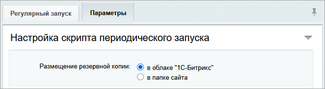{width=662px height=182px}

3. Задайте метод запуска скрипта и расписание. Подробнее о методах читайте [ниже](./backup.md#methods).

   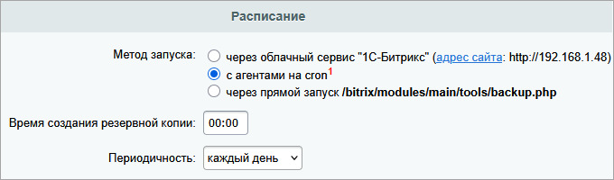{width=680px height=200px}

4. Настройте, как удалять старые копии.

   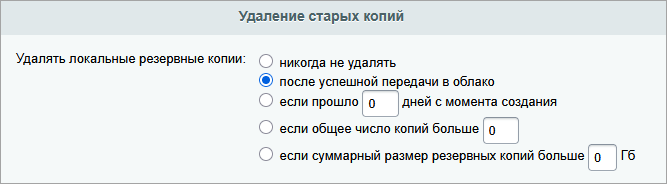{width=667px height=184px}

5. Укажите, какие части сайта включать или исключать из архива. Параметры повторяют [настройки вручную](./backup.md#expert).

    

   При автоматическом создании резервной копии система сохраняет пароль шифрования в базе данных. Пароль хранится в зашифрованном виде. Ключ шифрования — это лицензионный ключ продукта.

   Чтобы расшифровать архив, нужен полный доступ к файлам сайта и к базе данных. Без такого доступа архив остается защищенным.

    

   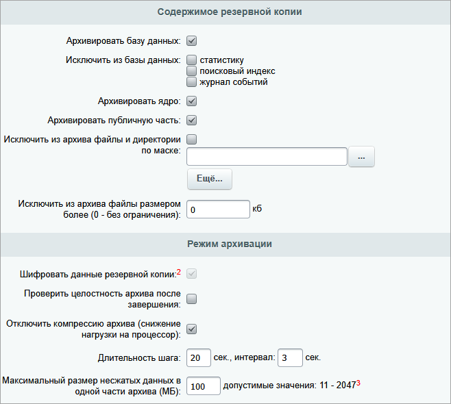{width=658px height=590px}

6. Сохраните настройки.

7. Перейдите на вкладку Регулярный запуск и нажмите Включить регулярное резервное копирование.

   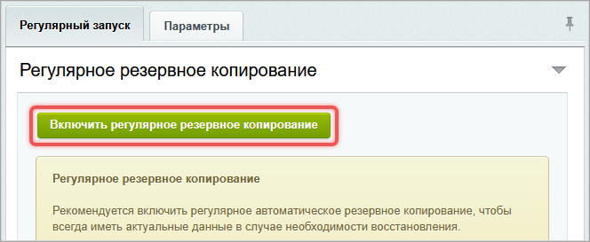{width=664px height=273px}

### Методы запуска {#methods}

Скрипт резервного копирования можно запустить одним из трех методов.

#### Запуск через облачный сервис

Способ подходит для небольших проектов. Он не требует настройки сервера — достаточно задать расписание: время создания копии и периодичность.

Когда наступает время копирования, облачный сервис обращается к специальной странице на сайте и передает параметры для создания архива. Сервису не нужен доступ к административной части.

Процесс состоит из четырех этапов.

1. Создание локальной копии на сервере.

2. Проверка целостности архива.

3. Отправка копии в облако.

4. Удаление локального архива после успешной загрузки.

Готовая копия появится в двух списках:

-  *Настройки > Облако 1С-Битрикс > Резервные копии*,

-  *Настройки > Инструменты > Резервное копирование > Список резервных копий*.



Время завершения может отличаться от заданного. Оно зависит от нагрузки на сервер.



#### Запуск через cron

Способ требует настройки `cron` на сервере. Скрипт `/bitrix/modules/main/tools/cron_events.php` должен запускаться каждую минуту.

Сначала скрипт обрабатывает почту и системные агенты. Если наступило время резервного копирования, создается архив. Такая схема позволяет выполнять почтовые задачи и агенты независимо от резервного копирования.

Особенности:

-  при ошибке повторная попытка возможна только через сутки,

-  в течение этого времени копию можно создать только вручную,

-  ошибки записываются в журнал на странице *Настройки > Инструменты > Резервное копирование > Журнал резервного копирования*.

#### Прямой запуск скрипта

Если проект не использует агенты, настройте запуск скрипта `/bitrix/modules/main/tools/backup.php` через панель хостинга. Укажите нужное время выполнения. Например, ночью, когда нагрузка на сервер минимальна.

Метод дает полный контроль над процессом, но требует ручной настройки расписания на стороне хостинга.

## Создать копию из командной строки

Создайте резервную копию через терминал, если у вас есть доступ к серверу по SSH.



Команды запускают резервное копирование с настройками, которые заданы в административном разделе. На странице *Настройки > Инструменты > Резервное копирование > Регулярное резервное копирование* обязательно укажите метод запуска как `прямой запуск`.



### Linux

Выполните команды от имени пользователя, под которым работает веб-сервер. В BitrixVM и BitrixEnv это пользователь `bitrix`.

1. Подключитесь к серверу по SSH.

2. Выполните команду:

   ```bash
   php -f /home/bitrix/www/bitrix/modules/main/tools/backup.php
   ```

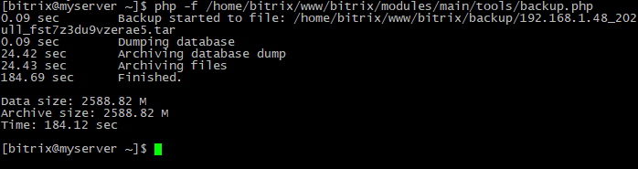{width=698px height=185px}

Архив сохраняется в папку `/bitrix/backup/`.

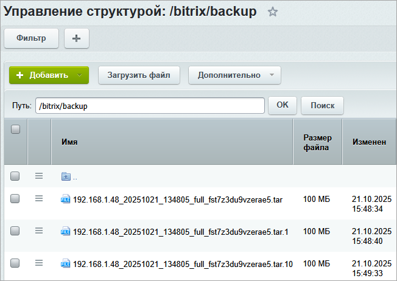{width=652px height=462px}

#### Задать имя архива

Чтобы указать собственное имя копии, перейдите в папку хранения и добавьте имя в конец команды:

```bash
cd /home/bitrix/www/bitrix/backup
php -f /home/bitrix/www/bitrix/modules/main/tools/backup.php my_name_backup
```

#### Архивировать папку upload отдельно

Папка `/upload` часто содержит много файлов. Архивируйте ее отдельно, чтобы не замедлять основное резервное копирование.

Пример команды:

```bash
tar -czvf upload.tar.gz ./upload
```

Выполните команду в той директории, в которой нужно сохранить архив.

### Windows

Перед запуском перейдите в папку c Битрикс: Веб-окружение, чтобы подключились нужные PHP-модули.

1. Если окружение установлено в `c:\Bitrix\`, выполните:

   ```bash
   cd c:\Bitrix\
   ```

2. Запустите резервное копирование.

   ```
   "C:\Bitrix\apache2\zendserver\bin\php.exe" -c "C:\Bitrix\apache2\zendserver\etc\php.ini" -f
   "C:\Bitrix\www\bitrix\modules\main\tools\backup.php"
   ```

## Резервное копирование при многосайтовости

Если на одном ядре Bitrix Framework работает несколько сайтов, резервное копирование имеет особенности.

-  В архив можно включить любые сайты. На странице *Настройки > Инструменты > Резервное копирование > Создание резервной копии* отметьте нужные.

-  База данных архивируется целиком, даже если сайт не был отмечен.

-  Мастер восстановления настраивает соединение с базой данных и корневую директорию только для первого сайта, остальные требуют ручной настройки после восстановления.

После распаковки появится предупреждение, что в архиве несколько публичных частей. Они хранятся в архиве в папках вида `/bitrix/backup/sites/ID_сайта`.

1. Вручную перенесите папки из `/bitrix/backup/sites/` в нужные директории на сервере.

2. Восстановите символьные ссылки на папки `/bitrix/` и `/upload/`.

## Как восстановить сайт

Сайт можно восстановить из резервной копии двумя способами: через административный раздел или с помощью скрипта `restore.php`.

### Административный раздел

Способ подходит, если можно зайти в панель управления.

1. Перейдите в *Настройки > Инструменты > Резервное копирование > Список резервных копий*.

2. Найдите нужную копию и в меню  выберите Восстановить.

   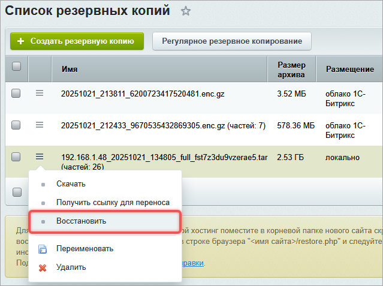{width=639px height=477px}

3. Следуйте инструкциям [мастера восстановления](./backup.md#restore).

### Скрипт restore.php

Используйте этот способ, если переносите сайт на новый хостинг или недоступен административный раздел.

1. Скачайте скрипт `restore.php` [по ссылке](https://www.1c-bitrix.ru/download/files/scripts/restore.php).

2. Поместите его в корневую папку сайта.

    

    Пользователь `bitrix` должен быть владельцем файла `restore.php`, иначе скрипт не сможет записывать файлы.

    

3. Откройте в браузере `https://ваш-сайт/restore.php`.

4. Следуйте инструкциям мастера по переносу продукта.

### Мастер восстановления {#restore}

Мастер адаптирует интерфейс под тип резервной копии.

#### Локальная копия

Для локальной копии мастер показывает окно с выбором архива.

{width=660px height=203px}

Нажмите Далее, мастер начнет распаковку. Если копия зашифрована, сначала запросит пароль.

#### Облачная копия

Для облачной копии система предложит выбрать источник:

-  развернуть копию из облака 1С-Битрикс — укажите лицензионный ключ, архив и пароль,

-  скачать по ссылке с другого сайта — получите ссылку на странице *Настройки > Инструменты > Резервное копирование > Список резервных копий*,

-  загрузить файлы с локального диска.

   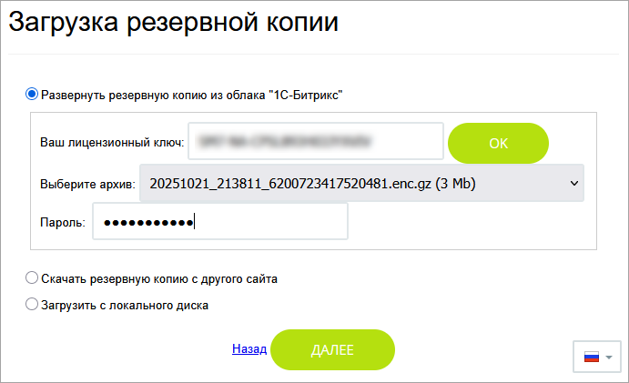{width=691px height=421px}



При многотомном архиве загрузите все части архива. Если появляется ошибка `413 Request Entity Too Large`, загружайте файлы партиями — по девять-десять штук за раз.



#### Восстановление базы данных

После распаковки выберите способ восстановления базы данных.

-  Пропустить восстановление базы — кнопка восстанавливает только файлы.

-  Восстановить — кнопка заменяет данные содержимым из архива.

-  Создать базу, если не существует — опция создает базу при переносе на новый сервер.

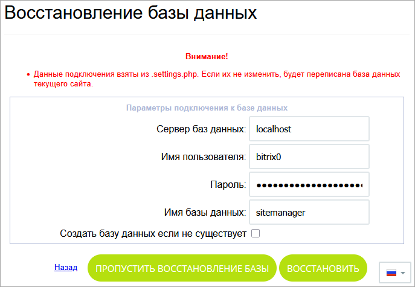{width=687px height=475px}

После завершения удалите локальную копию и служебные скрипты.

{width=699px height=186px}

### Модули Маркетплейс

Если восстанавливаете сайт из копии, которая сделана до установки модуля, в архиве модуль отсутствует. Его можно установить повторно, если не истек период подписки.

Некоторые модули сохраняют данные в базе сайта. Чтобы не потерять их, создайте резервную копию сразу после установки модуля.

## Восстановить отдельные файлы



Способ работает только с локальными архивами без шифрования.



Архив `backup.tar.gz` — это обычный файл, который можно распаковать вручную, как любой  архив.

В операционных системах семейства Linux архив `.tar.gz` можно распаковать с помощью `tar`.

-  Распаковать все содержимое:

   ```bash
   tar -xzvf backup.tar.gz
   /* где
       -x — извлекает файлы из архива
       -z — фильтрует архив с помощью gzip
       -v — предоставляет список обрабатываемых файлов
       -f — обязательная опция, которая указывает имя файла архива
   */
   ```

-  Распаковать конкретные файлы:

   ```bash
   tar -xzvf backup.tar.gz file1 dir2/file2
   ```

-  Посмотреть содержимое:

   ```bash
   tar -ztf backup.tar.gz | grep file2
   /* где
       -t - выводит содержание архива
   */
   ```

В операционной системе Windows используйте архиваторы: 7-Zip, WinRAR и другие.



Из архива можно извлечь только файлы сайта. Данные из инфоблоков  хранятся в базе данных. Их можно восстановить только через полное восстановление базы.



## Исправить ошибки

### Архив поврежден

**Ошибка.** Archive is corrupted, wrong block: 0.

**Причины.** Не хватает места или памяти на сервере, ограничения хостинга, сбой при создании архива.

**Решение.** Проверьте свободное место и лимиты. Если проблема сохраняется, обратитесь в техподдержку.

### Сайт не отвечает после восстановления

**Ошибка.** The script encountered an error and will be aborted.

**Причины**. Прервали работу мастера восстановления или произошел сбой в его работе.

**Решение**. Откройте в браузере: `https://ваш-сайт/restore.php`. Если скрипта `restore.php` нет, [скачайте](https://www.1c-bitrix.ru/download/files/scripts/restore.php) его заново и запустите мастер восстановления.

### Проблемы с авторизацией

После восстановления могут не работать вход через AD/LDAP и двухфакторная авторизация.

Решение через SQL-запросы:

1. отключите авторизацию через AD/LDAP для пользователя:

   ```sql
   UPDATE b_user SET EXTERNAL_AUTH_ID = NULL WHERE LOGIN = 'admin';
   ```

2. отключите двухфакторную авторизацию для всех пользователей:

   ```sql
   UPDATE b_option SET VALUE = 'N' WHERE MODULE_ID = 'security' AND NAME = 'otp_enabled';
   ```

3. сбросьте пароль администратора.