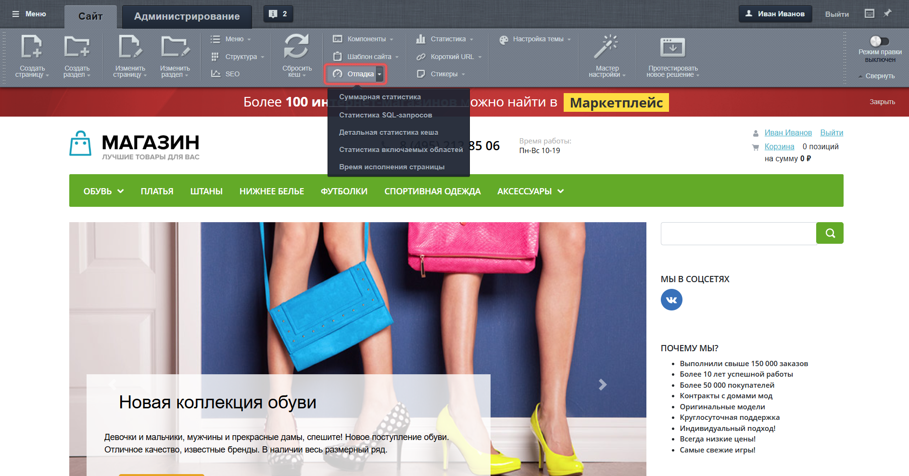
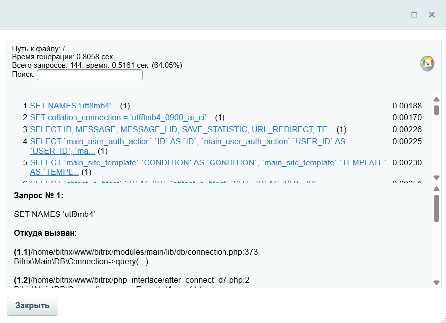
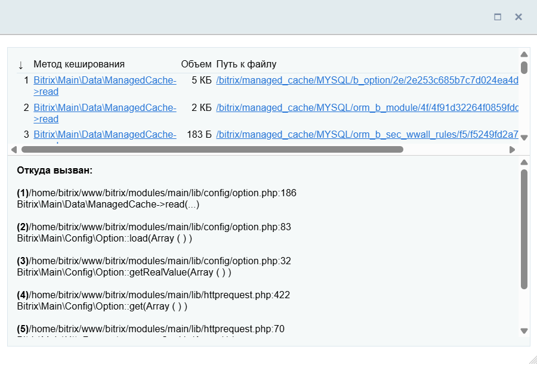
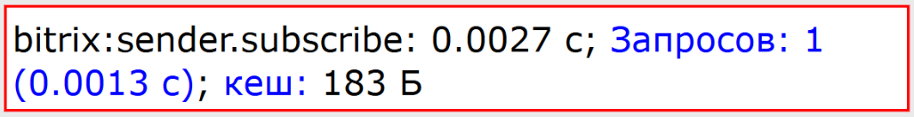
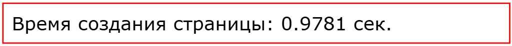
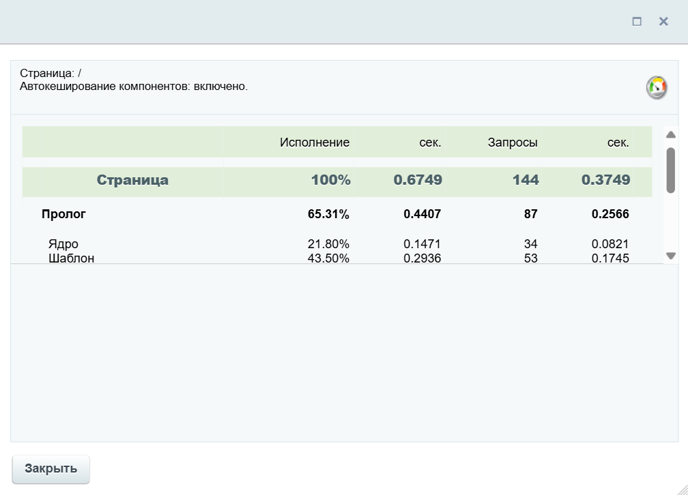
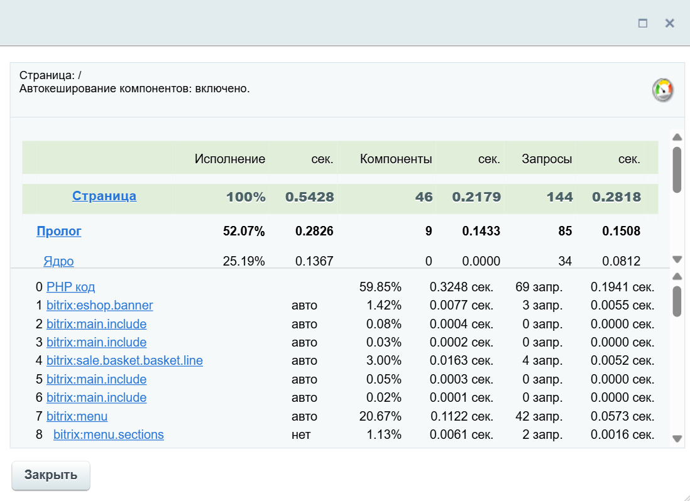

Инструменты для отладки в Bitrix Framework помогают находить ошибки и проверять производительность сайта.

## Отладка в публичной части сайта

Чтобы посмотреть статистику страницы в публичной части сайта, нажмите кнопку Отладка в панели администрирования. Статистика отобразится прямо на странице. Используйте выпадающее меню рядом с кнопкой, чтобы выбрать какие данные показывать.

{width=1890px height=992px}

### Суммарная статистика

Показывает общие данные по работе страницы:

-  статистику SQL-запросов,

-  статистику включаемых областей,

-  время исполнения страницы.

Чтобы включить, нажмите на кнопку Отладка или выберите Суммарная статистика в выпадающем меню.

### Статистика SQL-запросов

Показывает общее количество запросов к базе данных и время их выполнения.

1. Нажмите Отладка и в выпадающем меню выберите Статистика SQL-запросов.

2. Данные появятся в нижнем левом углу страницы.

   {width=974px height=132px}

3. Чтобы увидеть детализацию всех запросов, нажмите на ссылку *Всего SQL запросов*. Откроется новое окно с полным списком.

   {width=898px height=652px}

### Детальная статистика кеша

Показывает объем данных, которые кешируются для страницы.

1. Нажмите Отладка и в выпадающем меню выберите Детальная статистика кеша.

2. Данные появятся в нижнем левом углу страницы.

   {width=1508px height=135px}

3. Чтобы увидеть подробности, нажмите на ссылку *Объем* *кеша*. Откроется новое окно с детальной информацией.

   {width=900px height=612px}

### Статистика включаемых областей

Показывает служебную информацию о работе компонентов.

1. Нажмите Отладка и в выпадающем меню выберите Статистика включаемых областей.

2. Под каждым компонентом появятся данные о его работе.

Для детального анализа компонента:

1. Одновременно включите Статистика SQL-запросов и Детальная статистика кеша.

2. Рядом с компонентом появятся ссылки `Запросов: n` и `кеш`.

   {width=1028px height=132px}

3. Нажмите на любую из них, чтобы открыть подробную статистику в новом окне.

### Время исполнения страницы

Показывает, за какое время сервер сгенерировал страницу.

1. Нажмите Отладка и в выпадающем меню выберите Время исполнения страницы.

2. Время выполнения отобразится в нижнем левом углу.

   {width=1024px height=94px}

При одновременно отмеченных опциях Время исполнения страницы и Статистика SQL-запросов, появится ссылка *Время создания страницы*. Она откроет сводную статистику в новом окне.

{width=1008px height=726px}

Если дополнительно активирована Статистика включаемых областей, то в окне появится более подробная информация.

{width=1098px height=798px}



Когда включена кнопка Отладка, данные по SQL-запросам и времени загрузки также отображаются в административном разделе. Найти их можно в нижнем левом углу страницы.



## Отладка SQL-запросов с помощью SqlTracker

Инструмент `SqlTracker` помогает отслеживать, какие SQL-запросы выполняются, сколько времени занимают и откуда вызываются. Трекер является объектом класса `Bitrix\Main\Diag\SqlTracker`.

### Как включить трекинг

Получите объект соединения с базой данных и запустите трекер через метод `startTracker()`.

```php
// Получаем соединение с базой данных
$connection = \Bitrix\Main\Application::getConnection();

// Включаем отслеживание запросов
$connection->startTracker();
```

### Как получить результаты трекинга

1. Получите объект трекера с помощью `getTracker()`.

2. Остановите отслеживание через `stopTracker()`.

3. Извлеките запросы методом `getQueries()`.

После вызова `startTracker()` и до вызова `stopTracker()` все SQL-запросы сохраняются. Каждый запрос представлен объектом `Bitrix\Main\Diag\SqlTrackerQuery`.

```php
// Получаем объект трекера с собранными данными
$tracker = $connection->getTracker();

// Останавливаем отслеживание
$connection->stopTracker();

// Извлекаем все запросы из трекера
$queries = $tracker->getQueries();

// Перебираем все запросы, которые были выполнены в отслеживаемом участке кода
foreach ($queries as $query)
{
    echo 'SQL: ' . $query->getSql() . '<br>';
    echo 'Время: ' . round($query->getTime(), 5) . ' сек.<hr>';
}
```

### Пример использования

Проанализируем запросы, которые выполняются при получении списка активных пользователей.

```php
$connection = \Bitrix\Main\Application::getConnection();

$connection->startTracker();

// Выполняем SQL-запрос к таблице пользователей
$result = \Bitrix\Main\UserTable::getList([
    'filter' => ['ACTIVE' => 'Y'],
    'limit' => 5,
])->fetchAll();

$tracker = $connection->getTracker();

$connection->stopTracker();

$queries = $tracker->getQueries();

foreach ($queries as $query)
{
    echo 'SQL: ' . $query->getSql() . '<br>';
    echo 'Время: ' . round($query->getTime(), 5) . ' сек.<hr>';
}
```


Подробнее в статье [Отладка запросов](./../database/sql-tracker.md)



## Отладка сценариев с классом Debug

Класс `Debug` помогает записывать данные в файл и замерять время выполнения кода. Он может использоваться для отладки AJAX-запросов и CRON-задач.

### Как записать данные в файл

Класс `Debug` предоставляет три основных метода для отладки:

1. `writeToFile($var, $varName = "", $fileName = "")` — записывает значение переменной в файл. Для массивов используется функция `print_r()`, а для остальных типов данных значение преобразуется в строку.

   -  `$var` — переменная, содержимое которой необходимо записать в файл. Обязательный параметр.

   -  `$varName` — имя переменной или заголовок, который добавляется перед содержимым для идентификации записи в логе. Необязательный параметр, по умолчанию — пустая строка.

   -  `$fileName` — путь к файлу относительно корня сайта. Если не задан, данные записываются в файл `__bx_log.log` в корне сайта. Необязательный параметр, по умолчанию — пустая строка.

   ```php
   use Bitrix\Main\Diag\Debug;
   
   // Запись в файл по умолчанию
   Debug::writeToFile($_SERVER, 'Данные сервера');
   
   // Запись в указанный файл
   Debug::writeToFile($myArray, 'Мой массив', 'local/test_log.txt');
   ```

2. `dump($var, $varName = "", $return = false)` — выводит на экран структурированное представление переменной в удобочитаемом формате. Не записывает данные в файл.

   -  `$var` — переменная любого типа, содержимое которой нужно отобразить. Обязательный параметр.

   -  `$varName` — имя переменной или заголовок, который выводится перед содержимым. Необязательный параметр, по умолчанию — пустая строка.

   -  `$return` — флаг. Если `false`, результат выводится на экран. Если `true`, результат возвращается в виде строки. Необязательный параметр, по умолчанию — `false`.

    ```php
    use Bitrix\Main\Diag\Debug;

    // Вывод на экран
    Debug::dump($_SERVER, 'Данные сервера');

    // Получение результата в виде строки
    $debugInfo = Debug::dump($myObject, 'Объект', true);
    echo $debugInfo;
    ```

3. `dumpToFile($var, $varName = "", $fileName = "")` — комбинирует логику `dump()` и `writeToFile()`. Записывает в файл детальное структурированное представление переменной в формате, аналогичном функции `var_dump()`.

   -  `$var` — переменная, содержимое которой необходимо записать в файл. Обязательный параметр.

   -  `$varName` — имя переменной или заголовок, который добавляется перед содержимым для идентификации записи в логе. Необязательный параметр, по умолчанию — пустая строка.

   -  `$fileName` — путь к файлу относительно корня сайта. Если не задан, данные записываются в файл `__bx_log.log` в корне сайта. Необязательный параметр, по умолчанию — пустая строка.

   ```php
   use Bitrix\Main\Diag\Debug;
   
   // Запись структурированных данных в файл
   Debug::dumpToFile($_SESSION, 'Текущая сессия', 'local/logs/session_dump.log');
   ```

### Как замерить время выполнения кода

1. Ограничьте участок кода методами `startTimeLabel()` и `endTimeLabel()` с одинаковой меткой.

2. Выведите результаты всех замеров с помощью метода `getTimeLabels()`.

```php
use Bitrix\Main\Diag\Debug;

// Начинаем замер времени для участка кода с меткой "foo"
Debug::startTimeLabel("foo");
someSlowFunction();
// Завершаем замер для "foo"
Debug::endTimeLabel("foo");

// Начинаем замер времени для следующего участка кода с меткой "bar"
Debug::startTimeLabel("bar");
someOtherFunction();
// Завершаем замер для "bar"
Debug::endTimeLabel("bar");

// Выводим все результаты замеров времени
print_r(Debug::getTimeLabels());
```