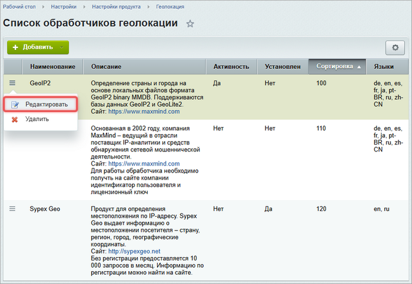

Геолокация позволяет определить страну, город и другие данные о посетителе по его IP-адресу. Данные можно использовать для персонализации контента, оформления заказа и региональных настроек.

В Bitrix Framework геолокация работает через обработчики. Это классы, которые получают информацию из локальных баз или внешних геосервисов.

## Доступные обработчики геолокации

Система поддерживает три готовых обработчика геолокации. Они отличаются источником данных, требованиями и возможностями.

### GeoIP2

Обработчик использует локальные файлы баз данных в формате GeoIP2 binary (MMDB). Поддерживает коммерческие базы GeoIP2 и бесплатные GeoLite2 от MaxMind.

Обработчик не выполняет сетевых запросов. Данные доступны только на языке базы — обычно на английском.

### MaxMind

Обработчик обращается к облачному API компании MaxMind. Выполняет сетевой запрос при каждом обращении. Поддерживает несколько языков и отличается высокой точностью данных.

### Sypex Geo

Обработчик использует внешний сервис Sypex Geo. Выполняет сетевой запрос к сервису. Поддерживает русский и другие языки. Имеет бесплатный лимит запросов — его размер указан на сайте Sypex Geo.

## Подключить геолокацию

Чтобы подключить геолокацию, выполните следующие действия:

1. Откройте страницу *Настройки > Настройки продукта > Геолокация*.

2. Выберите обработчик и дважды кликните по строке или в меню нажмите Редактировать.

   {width=700px height=484px}

3. Отметьте опцию Активность.

4. Задайте приоритет обработчика в поле Сортировка: чем меньше значение, тем выше приоритет.

5. Перейдите на вкладку Дополнительные и укажите индивидуальные параметры обработчика.

### Параметры GeoIP2

Заполните два обязательных поля.

-  Тип базы данных — выберите `GeoIP2/GeoLite2 City` или `GeoIP2/GeoLite2 Country` в зависимости от файла базы данных.

-  Абсолютный путь к файлу базы данных (\*.mmdb) — укажите путь к файлу относительно корня сайта, например, `/bitrix/geoip/GeoLite2-City.mmdb`. Файл должен быть доступен для чтения веб-сервером.

### Параметры MaxMind

Укажите три обязательных параметра.

-  Используемый веб-сервис — выберите сервис из списка.

-  Идентификатор пользователя — число из личного кабинета MaxMind.

-  Лицензионный ключ — строка из 32 символов, которая выдана в личном кабинете.

### Параметры Sypex Geo

В поле Ключ укажите строку, которую получили после регистрации на сайте Sypex Geo. Если не превышаете бесплатный лимит, поле можно оставить пустым.

## Добавить свой обработчик

Чтобы подключить собственный источник геоданных, выполните три шага.

1. Создайте собственный класс и унаследуйте его от `\Bitrix\Main\Service\GeoIp\Base`.

2. Добавьте в класс методы `getTitle()`, `getDataResult()` и другие.

3. Зарегистрируйте класс в событии `onMainGeoIpHandlersBuildList` модуля `main`.

Если обработчик активен, система будет использовать его наравне со встроенными.

## Работать с геолокацией через API

После настройки обработчиков используйте статические методы класса `\Bitrix\Main\Service\GeoIp\Manager` для получения геоданных.

### Получить название города или страны

Используйте методы `getCityName()` и `getCountryName()`, которые принимают два необязательных параметра.

-  `$ip` — IP-адрес. Если не указан, используется текущий IP посетителя.

-  `$lang` — код языка.

#### Город

```php
echo \Bitrix\Main\Service\GeoIp\Manager::getCityName();

echo \Bitrix\Main\Service\GeoIp\Manager::getCityName('92.50.195.50', 'ru');
// Калининград
```

Если данных нет, метод вернет пустую строку.

#### Страна

```php
echo \Bitrix\Main\Service\GeoIp\Manager::getCountryName('92.50.195.50', 'ru');
// Россия

echo \Bitrix\Main\Service\GeoIp\Manager::getCountryCode('92.50.195.50');
// RU
```

Система автоматически определяет реальный IP-адрес посетителя с помощью метода `GeoIp\Manager::getRealIp()`. Он корректно обрабатывает прокси и заголовки вида `X-Forwarded-For`.

Передавайте IP вручную только в особых случаях: например, при обработке фоновых задач или вебхуков.

### Получить координаты

Чтобы получить широту и долготу, вызовите метод `getGeoPosition()`.

```php
$pos = \Bitrix\Main\Service\GeoIp\Manager::getGeoPosition('92.50.195.50');
// ['latitude' => 54.70649, 'longitude' => 20.51095]
```

Если координаты недоступны, метод вернет `null`.

Чтобы получить отдельно широту или долготу, используйте `getGeoPositionLatitude()` и `getGeoPositionLongitude(`).

```php
$lat = \Bitrix\Main\Service\GeoIp\Manager::getGeoPositionLatitude('92.50.195.50');
$lon = \Bitrix\Main\Service\GeoIp\Manager::getGeoPositionLongitude('92.50.195.50');

if ($lat !== '' && $lon !== '')
{
    echo "Координаты: $lat, $lon";
}
```

При отсутствии данных методы возвращают пустую строку.

### Получить дополнительные данные

Чтобы получить провайдера, организацию, временную зону или почтовый индекс, используйте следующие методы:

```php
echo \Bitrix\Main\Service\GeoIp\Manager::getIspName('92.50.195.50'); // Провайдер
echo \Bitrix\Main\Service\GeoIp\Manager::getOrganizationName('92.50.195.50'); // Организация
echo \Bitrix\Main\Service\GeoIp\Manager::getTimezoneName('92.50.195.50'); // Europe/Kaliningrad
echo \Bitrix\Main\Service\GeoIp\Manager::getCityPostCode('92.50.195.50'); // Почтовый индекс
```

Если сервис не предоставляет запрашиваемые данные, каждый метод возвращает пустую строку.

### Получить все данные сразу

Используйте метод `getDataResult()`, если нужно получить сразу несколько полей и убедиться, что все они доступны.

```php
$geoResult = \Bitrix\Main\Service\GeoIp\Manager::getDataResult(
    '92.50.195.50',
    'ru',
    ['countryName', 'cityName', 'latitude', 'longitude']
);

if ($geoResult && $geoResult->isSuccess())
{
    $data = $geoResult->getGeoData();
    echo $data->cityName; // Калининград
    echo $data->countryName; // Россия
    echo $data->latitude; // 54.70649
}
else
{
    echo 'Нет данных для этого IP';
}
```

Метод последовательно опрашивает активные обработчики и выбирает первый, который может вернуть все запрошенные поля. При успехе возвращает объект `\Bitrix\Main\Service\GeoIp\Data`. Если ни один обработчик не смог ответить, метод вернет `null`.

Проверяйте результат напрямую. Не используйте устаревшую константу `GeoIp\Manager::INFO_NOT_AVAILABLE`.

### Включить ведение лога

Чтобы отладить работу геосервисов, включите запись ошибок в системный журнал с помощью метода `setLogErrors()`.

```php
\Bitrix\Main\Service\GeoIp\Manager::setLogErrors(true);
$geoResult = \Bitrix\Main\Service\GeoIp\Manager::getDataResult('92.50.195.50');
```

##