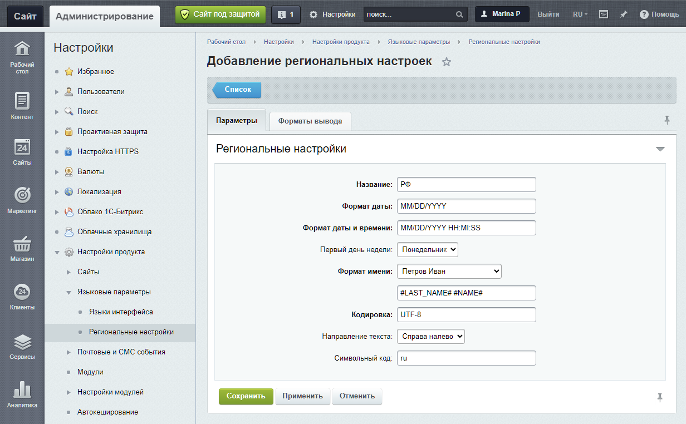
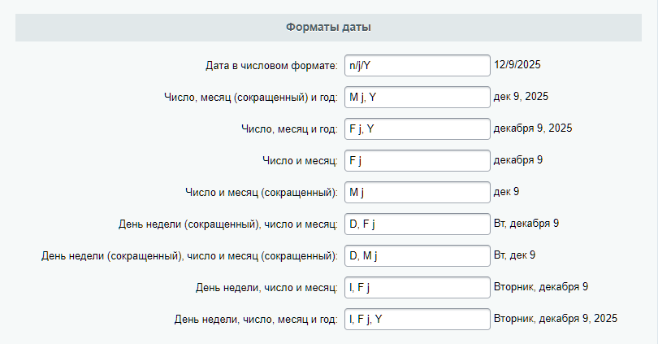
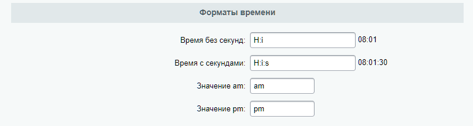
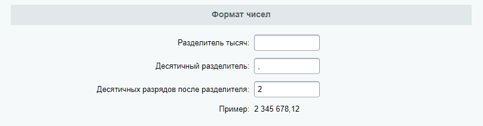
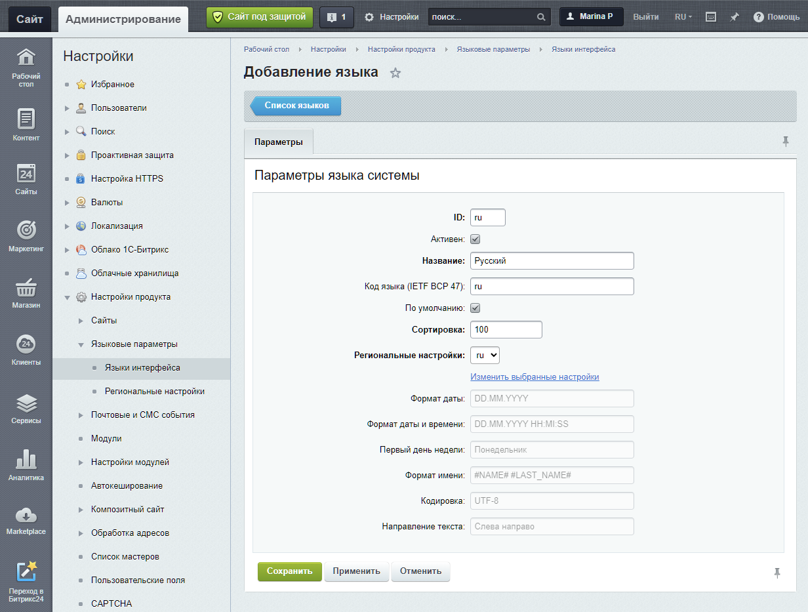
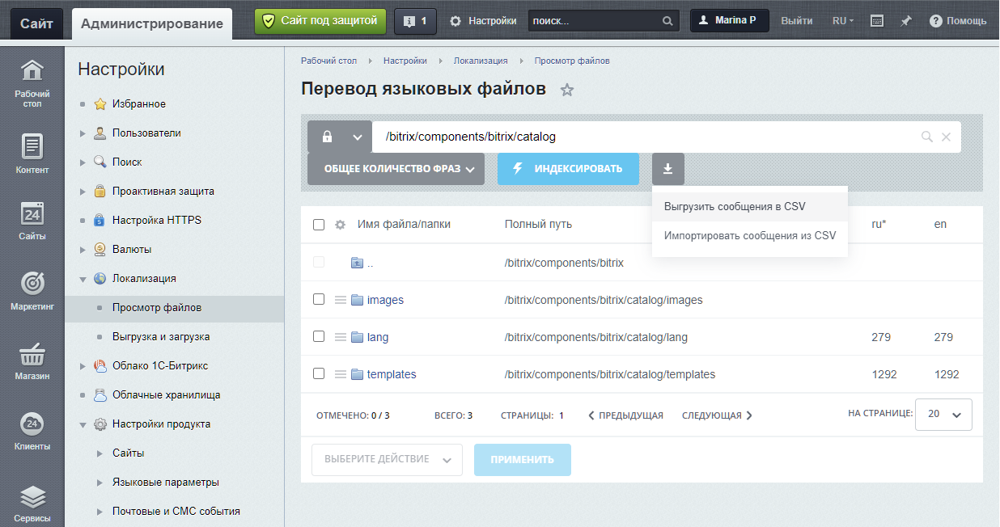

Локализация — это процесс адаптации интерфейса и данных системы под языковые и культурные особенности региона. В Bitrix Framework локализация включает управление языками интерфейса, региональными настройками и языковыми сообщениями.

## Региональные настройки

Региональные настройки — это набор параметров, которые зависят от региона: формат даты и времени, формат имени, первый день недели. Укажите эти настройки при добавлении языка интерфейса и при создании сайта. Система отобразит элементы сайта с учетом параметров выбранного языка.

Управлять настройками можно в административном разделе на странице *Настройки > Настройки продукта > Языковые параметры > Региональные настройки.*



Если компонент имеет собственные настройки формата даты, он будет использовать их, а не общие региональные настройки.



### Добавить настройки

Нажмите кнопку *Добавить* на странице *Настройки > Настройки продукта > Языковые параметры > Региональные настройки*. Настройте две вкладки в форме создания.

1. **Параметры.** Укажите основные параметры региона.

   {width=1232px height=762px}

2. **Форматы вывода.** Настройте детальные форматы для дат, времени и чисел.

   {width=810px height=423px}

   {width=806px height=215px}

   {width=808px height=211px}

## Языки интерфейса

Языки интерфейса управляют отображением системных сообщений в административной части.

Настроить языки можно в административном разделе на странице *Настройки > Настройки продукта > Языковые параметры > Языки интерфейса.*

Языки публичного раздела настраиваются отдельно для каждого сайта в его параметрах.

### Добавить язык

Нажмите кнопку *Добавить язык* и заполните поля в форме создания.

{width=1232px height=933px}

1. ID — идентификатор языка. Он должен совпадать с идентификатором языка в системе обновлений *Marketplace > Обновление платформы*, чтобы загрузить правильные языковые файлы.

2. Название — название языка интерфейса.

3. Код языка (IETF BCP 47) — код в формате IETF. Код можно использовать для генерации HTTP-заголовков и сопоставления с данными GeoIP для выбора языка по региону.

4. Сортировка — относительный вес, который определяет положение языка в общем списке.

5. Региональные настройки — выбор ранее созданных региональных настроек, которые система применит к этому языку.

После сохранения новый язык появится в общем списке и в переключателе на административной панели. Загрузить системные языковые файлы для нового языка можно на странице *Marketplace > Обновление платформы.*

## Механизм языковых сообщений

Система хранит все тексты интерфейса в языковых файлах. Для каждого модуля и компонента создают свой набор таких файлов. Файлы с переводами лежат в папках `/lang/<код языка>/`.

### Создать языковые файлы

1. Создайте папку `lang` в корне вашего проекта: шаблона, компонента, скрипта.

2. Внутри создайте подпапки для каждого языка, например, `ru` и `en`.

3. В каждой языковой папке создайте PHP-файлы для языковых сообщений. Имя файла должно совпадать с именем основного PHP-файла, где нужны переводы.

    

    Сохраняйте файлы в кодировке UTF-8 без BOM

    

Пример структуры файлов для своего скрипта `mylib.php`:

```plain text
/local/php_interface/
├── mylib.php                     # Основной файл скрипта
└── lang/
    ├── ru/                       # Папка для русского языка
    │   └── mylib.php             # Языковой файл с русскими фразами
    └── en/                       # Папка для английского языка
        └── mylib.php             # Языковой файл с английскими фразами
```

Содержимое языкового файла — это массив `$MESS`. Система автоматически ищет и загружает фразы из него.

```php
<?php
$MESS['MYMODULE_GREETING'] = 'Здравствуйте!';
$MESS['MYMODULE_BUTTON'] = 'Отправить';
```

Строка в квадратных скобках, например, `'MYMODULE_GREETING'` — это уникальный код фразы. Используйте префиксы в кодах фразы вида `MYMODULE_`. Это помогает создать уникальный код, что снижает риск конфликтов.

Если переводы не работают, проверьте, чтобы структура папок и имена файлов точно совпадали.

### Использовать языковые сообщения в PHP-коде

Чтобы связать PHP-код с языковыми файлами, используйте методы класса `Bitrix\Main\Localization\Loc`:

-  `loadMessages()` — загрузить файл,

-  `getMessage()` — получить языковое сообщение.

### Автоматическая загрузка языковых файлов

Для компонентов и шаблонов, созданных по правилам Bitrix Framework, система подключает языковые файлы автоматически. Примеры стандартных языковых файлов:

-  компонент — `/bitrix/components/bitrix/catalog/lang/ru/.parameters.php`,

-  шаблон компонента — `/bitrix/components/bitrix/catalog/templates/.default/lang/ru/element.php`.

Система получает фразы из таких файлов через `Loc::getMessage()` без дополнительных действий.

Подключение файлов вручную через `Loc::loadMessages()` нужно:

-  для собственных PHP-скриптов вне структуры компонентов, например, файлов в `/local/php_interface/`,

-  для файлов, находящихся в нестандартных местах.

#### Подключить файл

Метод `loadMessages` подключает языковой файл. Укажите его в начале PHP-файла.



Используйте метод для ручного подключения языковых файлов, когда автоматическая загрузка не применяется.



```php
<?php
use Bitrix\Main\Localization\Loc;

Loc::loadMessages(__FILE__);
```

Константа `__FILE__` содержит полный путь к текущему файлу, по которому будет найден соответствующий языковый файл в папке `/lang/`.

Чтобы загрузить языковый файл для другого файла, вместо константы `__FILE__` укажите путь к этому файлу.

```php
Loc::loadMessages($_SERVER['DOCUMENT_ROOT'] . '/local/myscript.php');
```

#### Получить языковое сообщение

Метод `getMessage` возвращает сообщение по коду.

```php
\Bitrix\Main\Localization\Loc::getMessage($code, $replace, $language)
```

-  `$code` — код сообщения. Должен быть уникальным.

-  `$replace` — массив для замены по шаблону в формате `"шаблон" => "замена"`. Например, `["#NUM#" => 5]`.

-  `$language` — ID языка. Если не указан, используется текущий.

В коде замените статичный текст на вызов метода `getMessage` с кодом языкового сообщения.

```php
<?=Loc::getMessage('MYMODULE_GREETING')?>
```

**Пример.** Сообщение в языковом файле содержит шаблоны, вместо которых можно подставить данные.

-  `#NAME#` — имя.

-  `#NUM#` — количество.

```php
$MESS['WELCOME_TEXT'] = 'Привет, #NAME#! Количество новых сообщений: #NUM#';
```

В параметре `$replace` укажем, на что заменить шаблоны.

```php
<?php
echo Loc::getMessage('WELCOME_TEXT', ['#NAME#' => 'Алексей', '#NUM#' => 5]);
```

Результат — сообщение с текстом `Привет, Алексей! Количество новых сообщений: 5`.

#### Влияние на производительность

Ядро Bitrix Framework использует механизм отложенной загрузки. Система загружает языковой файл в момент первого вызова `Loc::getMessage()` для фразы из этого файла. Это повышает производительность, когда сообщения используются редко.

Для работы отложенной загрузки нужно соблюдать соответствие между файлом, где вызывается `Loc::getMessage()`, и языковым файлом. Например:

-  файл с кодом — `\bitrix\modules\main\admin\agent_edit.php`,

-  языковой файл — `\bitrix\modules\main\lang\ru\admin\agent_edit.php`



Если вызвать `Loc::getMessage()` с кодом из другого языкового файла, система не сможет использовать отложенную загрузку. Система начнет искать фразу, последовательно загружая и проверяя другие файлы, что замедляет работу.



Чтобы найти проблемные фразы, включите режим отладки. Для этого определите константу `BX_MESS_LOG` и укажите путь к файлу лога.

```php
define('BX_MESS_LOG', $_SERVER['DOCUMENT_ROOT'] . '/messages.log');
```

В лог попадут записи о фразах, которые система не смогла найти в ожидаемом файле. Пример записи в логе:

```plain text
[ru]SOME_MESSAGE: not found for /home/bitrix/modules/demo/lib/label.php
CTranslateUtils::CopyMessage('DEMO_MODULE_MESSAGE', '/home/bitrix/modules/demo/lib/file.php', '/home/bitrix/modules/demo/lib/internal/file.php');
```

-  первая строка — фраза `SOME_MESSAGE` для русского языка не найдена для указанного файла.

-  вторая строка — фраза `DEMO_MODULE_MESSAGE` найдена в другом файле. Строка содержит готовый PHP-код для ее копирования между языковыми файлами.



Не копируйте фразы автоматически. Выберите подходящее решение: копировать фразу, переименовать фразу или переместить файл.



### Получить региональные параметры

Класс `\Bitrix\Main\Context\Culture` хранит региональные настройки: форматы даты, времени, имени, разделители чисел. Эти настройки класс берет из региональных параметров языка сайта.

Система автоматически создает контекст запроса для каждой страницы. Контекст содержит всю информацию о запросе: язык, региональные настройки, пользователя.

-  Получить контекст можно методом `getCurrent` класса `\Bitrix\Main\Context`.

-  Получить региональные настройки в контексте текущего запроса можно методом `getCulture`.

```php
$context = \Bitrix\Main\Context::getCurrent();
$culture = $context->getCulture();
```

Основные методы класса `Culture`:

-  `getDateTimeFormat()` — возвращает полный формат даты и времени,

-  `getDateFormat()` — возвращает формат даты,

-  `getNameFormat()` — возвращает формат отображения имени пользователя.

## Локализация в JavaScript и Vue

Bitrix Framework поддерживает локализацию не только в PHP, но и в клиентской части: в JavaScript и компонентах на BitrixVue. Система автоматически передает необходимые языковые фразы из PHP в JavaScript-окружение.

### JavaScript

В JavaScript-скриптах Bitrix Framework глобально доступна функция `BX.message`. Она предоставляет доступ к языковым сообщениям, которые система автоматически загружает на страницу. Использовать функцию можно двумя способами.

1. Получить сообщение по строковому идентификатору.

   ```javascript
   // Получить текст фразы по ее коду
   var buttonText = BX.message('BUTTON_SAVE');
   ```

2. Добавить или перезаписать сообщения, передав объект `{ключ: "фраза"}`. Это нужно для динамической подгрузки переводов.

   ```javascript
   // Добавить новые фразы в общий набор
   BX.message({
       'MY_NEW_GREETING': 'Привет!',
       'MY_NEW_LABEL': 'Метка'
   });
   // Теперь их можно получить
   console.log(BX.message('MY_NEW_GREETING')); // Выведет: Привет!
   ```

Основной набор сообщений система формирует автоматически. Используйте `BX.message(объект)`, когда нужно добавить переводы, полученные, например, асинхронно.

Пример использования:

```javascript
// Получение фразы
var buttonText = BX.message('BUTTON_SAVE');

// Использование с заменой, если шаблоны определены в PHP-файле
var welcomeText = BX.message('WELCOME_TEXT').replace('#NAME#', userName);
```

### Компоненты BitrixVue 3

Для приложений и компонентов, созданных на BitrixVue 3, локализация доступна через класс `$Bitrix.Loc`, который внедряется в экземпляр Vue.

#### Получить фразу по коду

Метод `$Bitrix.Loc.getMessage(name, replacements)` возвращает фразу по коду.

-  `name` — код фразы.

-  `replacements` — объект с заменами по шаблонам. Поддерживает реактивные данные — свойства компонента, которые Vue автоматически отслеживает. Когда их значение меняется, Vue обновляет все места в шаблоне, где это значение используется, включая текст внутри локализованных фраз.

```javascript
// В шаблоне
template: `<button>{{ $Bitrix.Loc.getMessage('UI_BUTTON_SAVE') }}</button>`

// С реактивной заменой
const Counter = {
    data()
    {
        return { counter: 0 }
    },
    created()
    {
        setInterval(() => this.counter++, 1000);
    },
    template: `
        {{ $Bitrix.Loc.getMessage('DEMO_COUNTER', {'#COUNTER#': this.counter}) }}
    `
};
```

#### Получить все языковые фразы

Метод `$Bitrix.Loc.getMessages()` возвращает объект со всеми фразами, которые есть в текущем Vue-приложении.

```javascript
// Получить все фразы в компоненте
created()
{
    const allMessages = this.$Bitrix.Loc.getMessages();
    console.log(allMessages);
}
```

#### Установить языковые фразы

Метод `$Bitrix.Loc.setMessage(id, value)` позволяет вручную установить языковые фразы для приложения. Это нужно, если компонент работает как внешний виджет.

-  `id` — код фразы или объект с несколькими фразами.

-  `value` — значение языковой фразы.

```javascript
beforeCreate()
{
    // Установить одну фразу
    this.$bitrix.Loc.setMessage('DEMO_COUNTER', 'Счетчик: #COUNTER#');
    
    // Установить несколько фраз
    this.$bitrix.Loc.setMessage({
        DEMO_COUNTER: 'Счетчик: #COUNTER#',
        DEMO_PHRASE_2: 'Фраза 2',
    });
}
```

#### Получить фразы по фильтру

Если компонент использует сотни фраз, прямой вызов `getMessage()` в шаблоне может создать нагрузку. Для оптимизации используйте вычисляемое свойство с `BitrixVue.getFilteredPhrases()`.

Метод `BitrixVue.getFilteredPhrases(phrasePrefix, phrases)` возвращает объект с фразами, которые начинаются с заданного префикса.

-  `phrasePrefix` — префикс фразы. Можно передать массив префиксов, например, `['PREFIX_1', 'PREFIX_2']`.

-  `phrases` — объект с фразами. По умолчанию — `BX.message`. Если компонент используется как внешний виджет, то в этот параметр нужно передать контекст vue-компонента `this`.

```javascript
import { BitrixVue } from 'ui.vue3';

const MyComponent = {
    computed: {
        localize()
        {
            // Возвращает все фразы с префиксом 'MYCOMP_'
            return BitrixVue.getFilteredPhrases('MYCOMP_');
        }
    },
    template: `
        <div>
            <h1>{{ localize.MYCOMP_TITLE }}</h1>
            <p>{{ localize.MYCOMP_DESCRIPTION }}</p>
        </div>
    `
};
```

Этот подход снижает нагрузку при рендеринге, так как обращение к фразам происходит как к статическим свойствам объекта.

## Инструменты для работы с переводами

Для удобства массового редактирования фраз и переноса локализаций между системами, в Bitrix Framework есть два инструмента.

1. Экспорт и импорт через CSV.

2. Сбор и загрузка пакетов локализации.

### Экспорт и импорт через CSV

Инструмент экспорта и импорта через CSV помогает править много фраз одновременно. Просматривать фразы и использовать инструмент можно на странице *Настройки > Локализация > Просмотр файлов*.

{width=1236px height=652px}



Нажмите кнопку *Индексировать*, чтобы система нашла языковые файлы.



#### Выгрузить сообщения

1. Откройте нужную папку с файлами.

2. Нажмите *Выгрузить сообщения в CSV*.

3. Настройте выгрузку: выберите языки и укажите пути к конкретным папкам, если нужно.

4. Нажмите *Экспортировать*.

5. Скачайте файл экспорта.

#### Загрузить переводы из CSV-файла

1. Отредактируйте фразы в скачанном CSV-файле.

2. Нажмите *Импортировать сообщения из CSV*.

3. Выберите файл, укажите кодировку и способ добавления.

4. Нажмите *Импортировать*.

### Сбор и загрузка пакетов локализации

Вы можете создать полный пакет локализации для любого языка на странице *Настройки > Локализация > Выгрузка и загрузка.*

{width=1235px height=576px}

#### Собрать пакет перевода

1. На вкладке *Сбор переводов* укажите язык, дату сборки, кодировку.

2. Нажмите *Собрать локализацию*.

3. Система создаст архив для скачивания.

#### Загрузить пакет перевода в систему

1. На вкладке *Загрузка переводов* выберите файл архива.

2. Укажите язык. Если его нет в системе — добавьте новый.

3. Отметьте опцию *Обновить локализацию в публичной части*, если нужно обновить фразы на сайте.

4. Нажмите *Загрузить локализацию*.