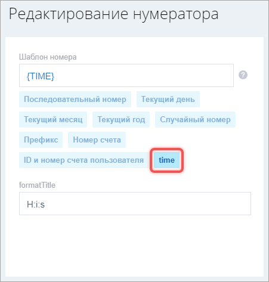

Нумератор генерирует уникальные номера по заданному шаблону. В шаблоне используются служебные слова: `{NUMBER}`, `{YEAR}`, `{RANDOM}` и другие.

Нумератор обеспечивает уникальность порядковых номеров даже при одновременных запросах.

## Логика работы

Нумератор состоит из генераторов — классов, которые подставляют значения вместо служебных слов.

Каждый генератор работает только с определенными типами нумераторов. Список доступных слов зависит от типа. Получить список можно с помощью метода `getTemplateWordsForType`.

```php
use Bitrix\Main\Numerator\Numerator;

$templateWords = Numerator::getTemplateWordsForType('DOCUMENT');
// Или 'ALL', чтобы получить слова для всех типов
```

Результат с базовым набором:

```php
[
    'Bitrix_Main_Numerator_Generator_SequentNumberGenerator' => [
        '{NUMBER}',
    ],
    'Bitrix_Main_Numerator_Generator_DateNumberGenerator' => [
        '{DAY}',
        '{MONTH}',
        '{YEAR}',
    ],
    'Bitrix_Main_Numerator_Generator_RandomNumberGenerator' => [
        '{RANDOM}',
    ],
    'Bitrix_Main_Numerator_Generator_PrefixNumberGenerator' => [
        '{PREFIX}',
    ],
];
```

### Базовые генераторы

Для всех типов нумераторов доступно четыре базовых генератора.

#|
|| **Генератор** | **Служебные слова** ||
|| `RandomNumberGenerator` |`{RANDOM}` — случайная строка из заглавных латинских букв и цифр ||
|| `DateNumberGenerator` |`{DAY}` — день месяца в момент генерации номера с ведущим нулем: `01`, `23` 
`{MONTH}` — месяц в момент генерации номера с ведущим нулем: `03`, `11`
`{YEAR}` — текущий год на момент генерации кода ||
|| `SequentNumberGenerator` | `{NUMBER}` — уникальный последовательный номер ||
|| `PrefixNumberGenerator` | `{PREFIX}` — фиксированный текст, который задан в настройках ||
|#

Пример преобразования:

```
Шаблон:      {PREFIX}__{YEAR}/{NUMBER}--{RANDOM}
               ↓          ↓       ↓         ↓
Генераторы:  Prefix     Date   Sequent   Random
               ↓          ↓       ↓         ↓
Значения:    'DOC'     '2025'   '007'   'A3F9K2'

Готовый номер:  DOC__2025/007--A3F9K2
```

### Дополнительные генераторы

#|
|| **Тип нумератора** | **Служебные слова** ||
|| `DOCUMENT` | `{CLIENT_ID}` — идентификатор клиента
`{SELF_ID}` — идентификатор объекта с данными
`{SELF_COMPANY_ID}` — идентификатор компании ||
|| `CRM_QUOTE` |`{QUOTE_ID}` — номер предложения
`{USER_ID_QUOTES_COUNT}` — идентификатор пользователя и число его предложений ||
|| `CRM_INVOICE` |`{INVOICE_ID}` — номер счета
`{USER_ID_INVOICES_COUNT}` — идентификатор пользователя и число его счетов ||
|| `ORDER` | `{USER_ID_ORDERS_COUNT}` — идентификатор пользователя и число его заказов
`{ORDER_ID}` — номер заказа ||
|#

### Как получить настройки нумератора

Чтобы получить настройки нумератора, используйте метод `getSettingsFields`.

```php
use Bitrix\Main\Numerator\Numerator;

$settings = Numerator::getSettingsFields('DOCUMENT');
```

Метод возвращает два массива:

-  `settingsFields` — описывает интерфейс настроек: типы полей, заголовки, значения по умолчанию,

-  `settingsWords` — связывает служебные слова с названиями в интерфейсе.

Пример результата:

```php
[
    'settingsFields' => [
        'Bitrix_Main_Numerator_Numerator' => [
            ['settingName' => 'name', 'type' => 'string', 'default' => 'Нумератор 1', 'title' => 'Название нумератора', ],
            ['settingName' => 'template', 'type' => 'string', 'title' => 'Шаблон номера',],
        ],
        'Bitrix_Main_Numerator_Generator_SequentNumberGenerator' => [
            ['settingName' => 'start', 'type' => 'int', 'default' => 1, 'title' => 'Начинать последовательный номер с',],
            ['settingName' => 'step', 'type' => 'int', 'default' => 1, 'title' => 'Увеличивать последовательный номер на',],
            ['settingName' => 'periodicBy', 'type' => 'array', 'title' => 'Период работы нумератора', 'values' => [
                ['settingName' => 'default', 'value' => '', 'title' => 'Постоянно',],
                ['settingName' => 'day', 'value' => 'day', 'title' => 'В пределах дня',],
                ['settingName' => 'month', 'value' => 'month', 'title' => 'В пределах месяца',],
                ['settingName' => 'year', 'value' => 'year', 'title' => 'В пределах года',],],
            ],
            ['settingName' => 'timezone', 'type' => 'array', 'values' => [...]],
            ...,
        ],
        ...,
    ],
    'settingsWords' => [
        'Bitrix_Main_Numerator_Generator_SequentNumberGenerator' => ['{NUMBER}' => 'Последовательный номер',],
        'Bitrix_Main_Numerator_Generator_DateNumberGenerator' => ['{DAY}' => 'Текущий день', '{MONTH}' => 'Текущий месяц', '{YEAR}' => 'Текущий год',],
        'Bitrix_Main_Numerator_Generator_RandomNumberGenerator' => ['{RANDOM}' => 'Случайный номер',],
        'Bitrix_Main_Numerator_Generator_PrefixNumberGenerator' => ['{PREFIX}' => 'Префикс',],
    ]
];
```

## Как добавить генератор

Генератор регистрируют в событии `onNumberGeneratorsClassesCollect`, потому что нумератор формирует динамически список доступных генераторов при инициализации.

Например, добавьте генератор `TimeNumberGenerator` и служебное слово `{TIME}`.

### Зарегистрировать класс в событии

Зарегистрируйте класс генератора в событии `onNumberGeneratorsClassesCollect`. Достаточно указать имя класса — `TimeNumberGenerator`. Метод `onGeneratorClassesCollect` реализован в базовом классе `\Bitrix\Main\Numerator\Generator\NumberGenerator`.

```php
RegisterModuleDependences(
    'main',
    'onNumberGeneratorsClassesCollect',
    'mymodule',
    'TimeNumberGenerator',
    'onGeneratorClassesCollect'
);
```

### Создать класс генератора

1. Унаследуйте класс `TimeNumberGenerator` от `NumberGenerator`.

2. В класс добавьте  методы:

   -  `getConfig` — возвращает текущие настройки. Например, формат времени.

   -  `setConfig` — устанавливает настройки при инициализации из базы.

   -  `getSettingsFields` — описывает поля настроек для интерфейса.

   -  `getTemplateWordsForParse` — перечисляет служебные слова, которые генератор может обработать. В примере —  `{TIME}`.

   -  `getTemplateWordsSettings` — сопоставляет служебные слова с  названиями. Используется для подписей на кнопках в интерфейсе. В примере — кнопка `time`.

   -  `getAvailableForType` — возвращает типы нумераторов, с которыми работает генератор. В примере — все типы `NUMERATOR_DEFAULT_TYPE`.

   -  `parseTemplate` — подставляет значение вместо служебного слова. Остальные слова оставляет без изменений, их обработают другие генераторы.

   -  `validateConfig` — проверяет корректность настроек.

```php
<?php
use Bitrix\Main\Localization\Loc;
use Bitrix\Main\Numerator\Generator\NumberGenerator;
use Bitrix\Main\Numerator\Generator\Contract\UserConfigurable;
use Bitrix\Main\Numerator\Numerator;

class TimeNumberGenerator extends NumberGenerator implements UserConfigurable
{
    const TEMPLATE_WORD_TIME = "TIME";
    protected $format;

    /** @inheritdoc */
    public function getConfig()
    {
        return ['format' => $this->format];
    }

    /** @inheritdoc */
    public function setConfig($config)
    {
        $this->setFromArrayOrDefault('format', $config, 'H:i:s', 'string');
    }

    /** @inheritdoc */
    public static function getSettingsFields()
    {
        return [
            [
                'settingName' => 'format',
                'type'        => 'string',
                'default'     => 'H:i:s',
                'title'       => 'Формат времени',
            ],
        ];
    }

    /** @inheritdoc */
    public static function getTemplateWordsForParse()
    {
        return [static::getPatternFor(static::TEMPLATE_WORD_TIME)];
    }

    /** @inheritdoc */
    public static function getTemplateWordsSettings()
    {
        return [static::getTemplateFor(static::TEMPLATE_WORD_TIME) => 'time'];
    }

    /** @inheritdoc */
    public static function getAvailableForType()
    {
        return Numerator::NUMERATOR_DEFAULT_TYPE;
    }

    /** @inheritdoc */
    public function parseTemplate($template)
    {
        return str_replace(
            static::getPatternFor(static::TEMPLATE_WORD_TIME),
            date($this->format, time()),
            $template
        );
    }

    /** @inheritdoc */
    public function validateConfig($config)
    {
        $result = new \Bitrix\Main\Result();
        return $result;
    }
}
```

После подключения класса в интерфейсе отображается кнопка `time`. Клик по кнопке вставляет слово `{TIME}` в шаблон.

{width=451px height=473px}

## Как создать нумератор

Чтобы создать нумератор, используйте класс `\Bitrix\Main\Numerator\Numerator`.

### Получить экземпляр

Вызовите метод `create`. Он возвращает пустой объект нумератора без имени и шаблона.

```php
use Bitrix\Main\Numerator\Numerator;

$numerator = Numerator::create();
```

### Передать конфигурацию

Конфигурация нумератора — ассоциативный массив. Ключ — тип класса генератора, значение — параметры.

#|
|| **Генератор** | **Параметры** ||
|| `Numerator` |`name` — название нумератора, обязательный параметр
`template` — шаблон номера, обязательный параметр ||
|| `SequentNumberGenerator` | `start` — с какого числа начинать
`step` — шаг для увеличения номера
`periodicBy` — сбрасывать счетчик в `start` при наступлении нового периода
`timezone` — по какому часовому поясу определять наступление нового периода
`isDirectNumeration` — использовать сквозную нумерацию или иметь независимые счетчики ||
|| `RandomNumberGenerator` | `length` — длина номера ||
|| `PrefixNumberGenerator` | `prefix` — строка символов ||
|| `DateNumberGenerator` | Без параметров ||
|#

```php
use Bitrix\Main\Numerator\Generator;

$config = [
    Numerator::getType() => [
        'name' => 'Мой нумератор',
        'template' => '{PREFIX}__{YEAR}/{NUMBER}--{RANDOM}',
    ],
    Generator\RandomNumberGenerator::getType() => [
        'length' => 6,
    ],
    Generator\SequentNumberGenerator::getType() => [
        'start' => 3,
        'step' => 2,
    ],
    Generator\PrefixNumberGenerator::getType() => [
        'prefix' => 'DOC',
    ],
];

$numerator->setConfig($config);
```

### Сохранить нумератор

Метод `save` возвращает объект результата. При успехе `$result->getId()` содержит идентификатор нового нумератора.

```php
$result = $numerator->save(); // \Bitrix\Main\Entity\AddResult
```

## Как получить нумератор

Нумератор можно загрузить по идентификатору или по типу. После загрузки вызовите метод `getNext`, чтобы получить следующий номер.

### Получить по идентификатору

```php
use Bitrix\Main\Numerator\Numerator;

$numerator = Numerator::load($numeratorId);
```

### Получить по типу

Первый нумератор указанного типа:

```php
use Bitrix\Main\Numerator\Numerator;

$numerator = Numerator::getOneByType('ORDER');
```

Список всех нумераторов указанного типа:

```php
use Bitrix\Main\Numerator\Numerator;

$numerators = Numerator::getListByType('CRM_INVOICE');
```

### Получить следующий номер

```php
$number = $numerator->getNext(); 
```

## Изменить настройки нумератора

Измените конфигурацию и сохраните с помощью метода `update`:

```php
use Bitrix\Main\Numerator\Numerator;

$numerator = Numerator::load($numeratorId);
$config = $numerator->getConfig();
$config[Numerator::getType()]['name'] = 'Обновленный нумератор';

$result = Numerator::update($id, $config);
```



Для существующих нумераторов не вызывайте метод `save`. Используйте `update`, чтобы избежать конфликтов при параллельных запросах.



## Передать контекст

В нумератор передают дополнительные данные, если генератор реализует интерфейс `DynamicConfigurable`.

Контекст или источник данных можно передать двумя способами.

1. При загрузке нумератора методом `load`.

   ```php
   $numerator = Numerator::load($id, $source);
   ```

2. Через метод `setDynamicConfig`.

   ```php
   $numerator->setDynamicConfig($config);
   ```

## Как использовать хеш

Нумератор с `{NUMBER}` может отвечать за несколько последовательных номеров и иметь несколько независимых счетчиков.

Если запросить следующий номер у нумератора, получите последовательно увеличивающееся число.

```php
use Bitrix\Main\Numerator\Numerator;

$numerator = Numerator::create();
$numerator->setConfig([
    Numerator::getType() => [
        'name' => 'test sequence',
        'template' => '{NUMBER}',
    ],
]);
$result = $numerator->save();
$numerator = Numerator::load($result->getId());
echo $numerator->getNext() . PHP_EOL;
$numerator = Numerator::load($result->getId());
echo $numerator->getNext() . PHP_EOL;
$numerator = Numerator::load($result->getId());
echo $numerator->getNext() . PHP_EOL;

// Получим
// 1
// 2
// 3
```

Если задать хеш и запросить номер для разного хеша, получите независимые счетчики.

```php
use Bitrix\Main\Numerator\Numerator;

$numerator = Numerator::create();
$numerator->setConfig([
    Numerator::getType() => [
        'name' => 'sequence',
        'template' => '{NUMBER}',
    ],
]);
$result = $numerator->save();
$numerator = Numerator::load($result->getId());
echo $numerator->getNext('A') . PHP_EOL;
$numerator = Numerator::load($result->getId());
echo $numerator->getNext('B') . PHP_EOL;
$numerator = Numerator::load($result->getId());
echo $numerator->getNext('A') . PHP_EOL;

// Получим
// 1
// 1
// 2
```

Хеш можно установить тремя способами.

1. В методе `load` вторым параметром в виде объекта, который реализует интерфейс `Hashable`.

   ```php
   use Bitrix\Main\Numerator\Numerator;
   
   Numerator::load($numeratorId, $hashable);
   ```

2. В  `setHash` через сеттер в виде объекта `Hashable`.

   ```php
   $numerator->setHash($hashable);
   ```

3. В методе `getNext` в виде строки.

   ```php
   $hash = 'MANAGER_42';
   $numerator->getNext($hash);
   ```