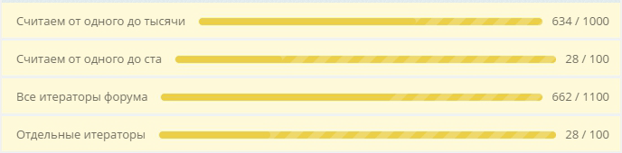

Итератор выполняет длительные операции по частям и сохраняет состояние между запусками.

## Создать итератор

Итератор реализован в базовом классе `\Bitrix\Main\Update\Stepper`. Чтобы настроить свой итератор, создайте новый класс-наследник.

1. Укажите идентификатор модуля.

2. Реализуйте метод `execute(array &$option)`.

3. Укажите, когда продолжить или завершить выполнение итератора с помощью констант `self::CONTINUE_EXECUTION` и `self::FINISH_EXECUTION`.

Один вызов `execute()` обрабатывает порцию элементов и увеличивает `steps` на количество обработанных элементов.

```php
<?php

namespace MyCompany\MyModule\Stepper;

use Bitrix\Main\Update\Stepper;

class ExampleStepper extends Stepper
{
    protected static $moduleId = 'mycompany.mymodule';
    
    // За один запуск обработаем один шаг и увеличим счетчик прогресса.
    public function execute(array &$option)
    {
        if (empty($option))
        {
            $option['steps'] = 0; // сколько обработано
            $option['count'] = 100; // всего шагов
        }
        
        $option["steps"]++;
        
        // Используем константы для указания статуса выполнения
        return ($option['steps'] < $option['count'])
            ? self::CONTINUE_EXECUTION
            : self::FINISH_EXECUTION;
    }
    
    // Переопределяем метод для отображения своего заголовка
    public static function getTitle()
    {
        return 'Пример обработки';
    }
}
```

Переопределяйте заголовок методом `getTitle()`, если нужно показывать свое название в интерфейсе.

Для одноразовых задач в класс можно добавить свойство `$deleteFile` со значением `true`. После завершения работы система удалит файл класса.

```php
protected $deleteFile = true;
```

## Запустить итератор

Итератор запускается как отложенный агент. Система выполняет его при каждом запросе к сайту, но не чаще одного раза в секунду.



Подробнее в статье [Агенты и фоновые задачи](./../framework/background-jobs.md)



Для создания агента можно использовать один из двух методов.

1. `bind($delay, $withArguments)` — создает агента для текущего класса. Используйте, когда модуль уже загружен, например, в обработчике события или в компоненте.

   -  `$delay` — задержка в секундах перед первым запуском. Значение по умолчанию — `300`.

   -  `$withArguments` — массив параметров для передачи в итератор.

   ```php
   // Запустить через 120 секунд
   if (\Bitrix\Main\Loader::includeModule('mycompany.mymodule'))
   {
       \MyCompany\MyModule\Stepper\ExampleStepper::bind(120);
   }
   ```

2. `bindClass($className, $moduleId, $delay, $withArguments)` — создает агента для указанного класса и модуля. Используйте в файлах установки модуля или когда модуль может быть не загружен.

   -  `$className` — полное имя класса итератора.

   -  `$moduleId` — идентификатор модуля, к которому привязан итератор.

   -  `$delay` — задержка в секундах перед первым запуском. Значение по умолчанию — `300`.

   -  `$withArguments` — массив параметров для передачи в итератор.

   ```php
   \Bitrix\Main\Update\Stepper::bindClass(
       'MyCompany\MyModule\Stepper\ExampleStepper',
       'mycompany.mymodule',
       60
   );
   ```

### Передать параметры в итератор

Передавайте параметры через `$withArguments`, если хотите запускать один и тот же Stepper с разными входными данными.

В массиве используйте простые типы: строку или целое число.

```php
// Запуск с параметрами
\Bitrix\Main\Update\Stepper::bindClass(
    'MyCompany\MyModule\Stepper\DataProcessor',
    'mycompany.mymodule',
    120,
    [
        'category_id' => 5,
        'action' => 'export',
        'limit' => 1000,
    ]
);
```

Получить параметры можно методом `getOuterParams()`.

```php
// Получение параметров в итераторе
public function execute(array &$option)
{
    $params = $this->getOuterParams();

    $categoryId = (int)($params['category_id'] ?? 0);
    $action = $params['action'] ?? '';
    
    // Используем параметры в логике
}
```

## Показать прогресс выполнения

Прогресс выполнения итераторов отображается с помощью элемента *Градусник*. Он показывает соотношение пройденных шагов к общему количеству шагов.

{width=688px height=170px}

1. Конкретный итератор — показывает прогресс только одного итератора. Используйте, чтобы отобразить статус конкретной операции.

   ```php
   echo \MyCompany\MyModule\Stepper\ExampleStepper::getHtml();
   ```

2. Все итераторы модуля — показывает общий прогресс всех итераторов модуля. Можно использовать для административной страницы модуля.

   ```php
   echo \Bitrix\Main\Update\Stepper::getHtml(
       'mycompany.mymodule',
       'Обработка данных модуля'
   );
   ```

3. Выборочные итераторы — показывает прогресс только указанных итераторов. Используйте, когда нужно сгруппировать связанные операции.

   ```php
   echo \Bitrix\Main\Update\Stepper::getHtml([
       'mycompany.mymodule' => [
           'MyCompany\MyModule\Stepper\DataMigrator',
           'MyCompany\MyModule\Stepper\CacheClear',
       ],
       'iblock' => [
           'Bitrix\Iblock\Stepper\SomeProcessor',
       ],
   ], 'Фоновая обработка');
   ```

*Градусник* опрашивает сервер о состоянии каждые пять минут, когда отображается на странице.

## Сохранить прогресс выполнения

Прогресс выполнения итератора между запусками можно хранить в массиве `$option`.

-  `steps` — количество выполненных шагов.

-  `count` — общее количество шагов.

-  другие данные для продолжения работы, например, последний обработанный `ID`.

Данные о шагах `steps` и `count` нужны для отображения прогресса в *Градуснике*.

```php
public function execute(array &$option)
{
    if (empty($option))
    {
        // Инициализация при первом запуске
        $option['steps'] = 0; // количество выполненных шагов
        $option['count'] = $this->calculateTotalItems(); // общее количество шагов
        $option['last_processed_id'] = 0;
        $option['processed_ids'] = [];
    }
    
    // Используем сохраненные данные
    $lastId = (int)$option['last_processed_id'];
    
    // Обрабатываем следующую порцию
    $processed = $this->processNextBatch($lastId, 50);
    
    // Сохраняем состояние для следующего запуска
    $option['last_processed_id'] = $processed['last_id'];
    $option['steps'] += $processed['count'];
    $option['processed_ids'] = array_merge(
        $option['processed_ids'],
        $processed['ids']
    );
    
    // Проверяем завершение
    return ($option['steps'] < $option['count'])
        ? self::CONTINUE_EXECUTION
        : self::FINISH_EXECUTION;
}
```



Не рекомендуется хранить большие объемы данных в массиве `$option`, так как массив сериализуется при каждом сохранении.

