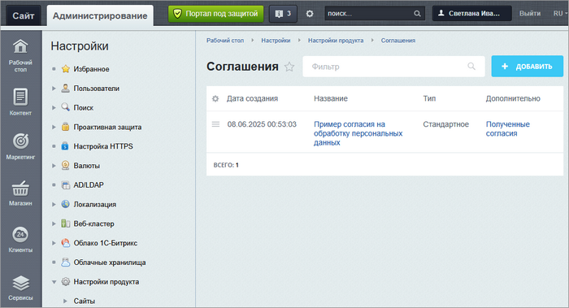
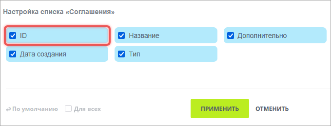
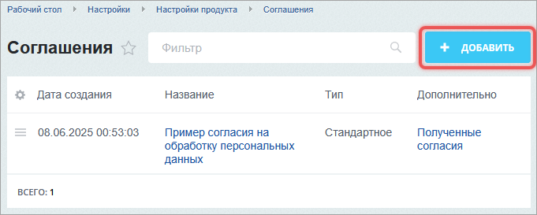
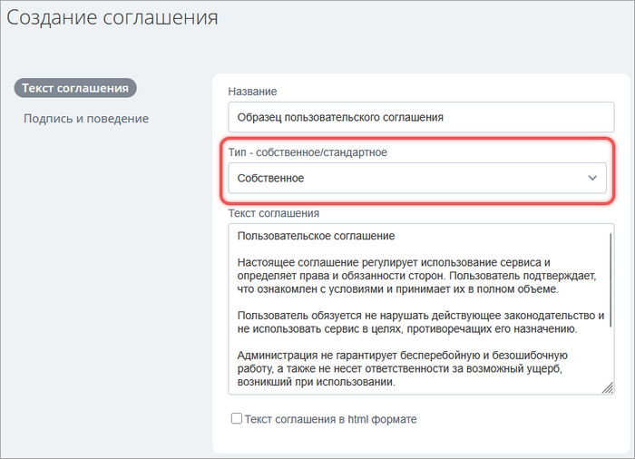
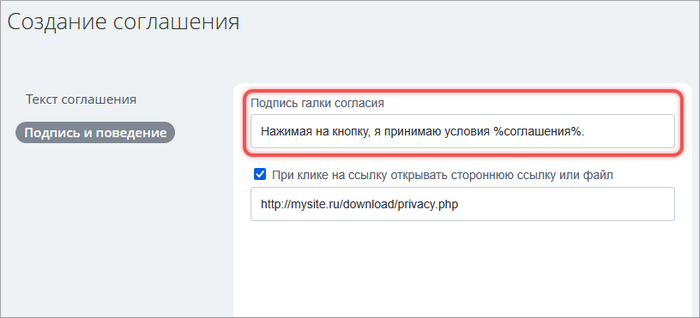
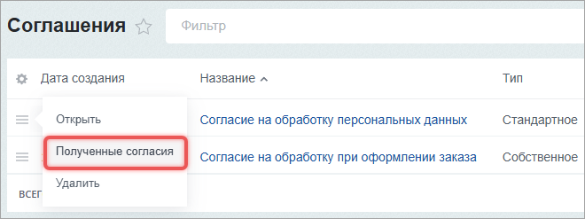
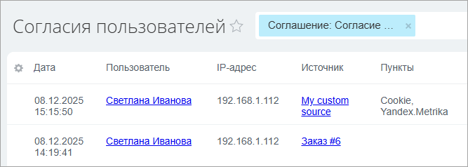

Пользовательские соглашения запрашивают согласия на обработку персональных данных, использование cookie, подключение аналитики и другие действия, которые требуют согласия по закону.

Система не позволяет удалять записи о полученных согласиях. Это юридическое требование законодательства.

## Открыть список соглашений

В административном разделе проекта перейдите на страницу *Настройки > Настройки продукта > Соглашения*.

{width=700px height=379px}

В таблицу можно добавить колонку с идентификатором соглашения.

1. Нажмите иконку шестеренки.

2. В форме отметьте `ID` и сохраните.

{width=679px height=259px}

## Создать соглашение

На странице Соглашения нажмите Добавить и заполните форму.

{width=681px height=273px}

### Выбрать тип соглашения

-  Стандартное — в готовом тексте можно изменить отдельные блоки: название и адрес компании.

-  Собственное — позволяет создать соглашение с собственным текстом.

{width=700px height=506px}

### Указать внешнюю ссылку на текст соглашения

Для собственного соглашения можно указать ссылку на текст соглашения, если текст размещен на веб-странице или в файле.

1. В форме соглашения оставьте пустым поле Текст соглашения.

2. Перейдите в раздел Подпись и поведение.

3. В поле *Подпись галки согласия* заключите в символы `%` часть текста, которая будет ссылкой. Если символы `%` не указаны, вся подпись является ссылкой.

4. Отметьте опцию *При клике на ссылку открывать стороннюю ссылку или файл*.

5. Укажите URL страницы или файла.

{width=700px height=318px}

### Настроить дополнительные параметры

Для соглашений типа Стандартное можно настроить дополнительные параметры.

-  Источник данных — выберите источник, откуда брать данные компании для соглашения.

-  Email-адрес для жалоб — задайте контактный адрес. Если поле оставить пустым, используется значение из настроек главного модуля.

## Подключить соглашение к собственному компоненту

В системных компонентах вывод соглашений предусмотрен по умолчанию.

В собственных компонентах соглашения нужно подключить вручную, если запрашиваете персональные данные или используете cookie. В результате система отобразит флажок и сохранит согласие.

Чтобы подключить соглашение, используйте параметр `USER_CONSENT`.

### Добавить параметр в настройки компонента

В файле параметров компонента `.parameters.php` объявите параметр `'USER_CONSENT' => []`.

```php
<?php
if (!defined('B_PROLOG_INCLUDED') || B_PROLOG_INCLUDED !== true)
{
    die();
}

$arComponentParameters = [
    'GROUPS' => [
    ],
    'PARAMETERS' => [
        'AJAX_MODE' => [],
        'USER_CONSENT' => [],
    ],
];
```

После этого в форме настроек компонента появится секция Согласие пользователя.

### Вывести запрос согласия

Запрос согласия отображается с помощью компонента `bitrix:main.userconsent.request`. Компонент показывает флажок и окно с текстом соглашения.



Один экземпляр компонента показывает одно соглашение. Для нескольких соглашений используйте компонент `main.userconsent.request` несколько раз.



#### Простая форма с событием submit

В шаблоне собственного компонента подключите `bitrix:main.userconsent.request` перед кнопкой отправки формы.

```php
<form method="POST">
    <input name="EMAIL" placeholder="Email">
    <input name="PHONE" placeholder="Телефон">
    <input name="NAME" placeholder="Имя">
    <br>
    <? if ($arParams['USER_CONSENT'] === 'Y'): ?>
        <? $APPLICATION->IncludeComponent(
            'bitrix:main.userconsent.request',
            '',
            [
                'ID' => $arParams['USER_CONSENT_ID'],
                'IS_CHECKED' => $arParams['USER_CONSENT_IS_CHECKED'],
                'IS_LOADED' => $arParams['USER_CONSENT_IS_LOADED'],
                'AUTO_SAVE' => 'Y',
                'REPLACE' => [
                    'button_caption' => 'Подписаться',
                    'fields' => ['Email', 'Телефон', 'Имя'],
                ],
            ]
        ); ?>
    <? endif; ?>
    <input type="submit" value="Подписаться">
</form>
```

Параметр `REPLACE` задает:

-  `button_caption` — текст кнопки в модальном окне,

-  `fields` — список полей, которые попадут в текст соглашения.

#### Форма без события submit

Способ подходит, если система отправляет форму через AJAX или JavaScript-механизмы.

Компонент `bitrix:main.userconsent.request` ожидает событие, которое указано в параметре `SUBMIT_EVENT_NAME`. Когда событие возникает, появляется окно запроса согласия.

После подтверждения пользователем компонент генерирует событие `BX.UserConsent.events.save`. Обработчик события отправляет данные или выполняет действие.

```php
<div id="my_container">
    <input type="text" placeholder="Электронный адрес" name="EMAIL">
    <input type="submit" id="fire_event" value="Отправить">
    <br>
    <? if ($arParams['USER_CONSENT'] === 'Y'): ?>
        <? $APPLICATION->IncludeComponent(
            'bitrix:main.userconsent.request',
            '',
            [
                'ID' => $arParams['USER_CONSENT_ID'],
                'IS_CHECKED' => $arParams['USER_CONSENT_IS_CHECKED'],
                'IS_LOADED' => 'Y',
                'AUTO_SAVE' => 'N',
                'SUBMIT_EVENT_NAME' => 'my-event-name',
                'REPLACE' => [
                    'button_caption' => 'Отправить',
                    'fields' => ['Электронный адрес'],
                ],
            ]
        ); ?>
    <? endif; ?>
</div>

<script>
BX.ready(() => {
    const submitBtn = BX('fire_event');
    BX.bind(submitBtn, 'click', () => {
        BX.onCustomEvent('my-event-name');
    });

    if (!BX.UserConsent)
    {
        return;
    }

    const control = BX.UserConsent.load(BX('my_container'));
    if (!control)
    {
        return;
    }

    BX.addCustomEvent(
        control,
        BX.UserConsent.events.save,
        (data) => {
            console.log('js event:', 'save', data);
            // Согласие получено — можно отправлять данные
            // Например: BX.ajax.runAction(...)
        }
    );
});
</script>
```

### Параметр AUTO_SAVE

В компоненте `bitrix:main.userconsent.request` есть параметр `AUTO_SAVE`.

-  `AUTO_SAVE = 'Y'` — согласие сохраняется автоматически после подтверждения.

-  `AUTO_SAVE = 'N'` — согласие нужно сохранить самостоятельно. Для ручного добавления согласия используйте метод `addByContext`.

   ```php
   \Bitrix\Main\UserConsent\Consent::addByContext(
       $arParams['USER_CONSENT_ID']  // идентификатор соглашения
   );
   ```
   
   

   Минимальный вызов сохраняет только факт согласия. Чтобы указать источник и пункты, передайте дополнительные параметры. Подробнее читайте ниже в разделе Добавить согласие через API.

    

## Добавить нестандартный источник

Система сохраняет согласие вместе с источником. Он указывает:

-  название и ссылку на форму или страницу, где получено согласие,

-  тексты выбранных пользователем пунктов, например, Cookie, Яндекс Метрика.

Стандартные источники покрывают типовые сценарии: регистрация, заказ, подписка. Свой источник регистрируют для нестандартных случаев: виджета, встраиваемой формы.

### Создать обработчик через CLI

Чтобы зарегистрировать собственный источник, добавьте обработчик события `OnUserConsentProviderList`. Для этого выполните CLI-команду:

```bash
php bitrix.php make:eventhandler --handler-module=my.module --event-module=main -m
```

Система создаст файл:

```
/local/modules/my.module/lib/Internals/Integration/Main/EventHandler/OnUserConsentProviderListEventHandler.php
```

### Зарегистрировать источник

1. В файл `OnUserConsentProviderListEventHandler.php` добавьте код регистрации источника.

2. Каждый источник опишите четырьмя ключами.

   -  `CODE` — уникальный идентификатор.  По нему система находит источник при вызове `addByContext`.

   -  `NAME` — имя источника в административном разделе и логах. Необязательный, если название указывают в `DATA`.

   -  `DATA` — функция возвращает название и URL. Принимает параметр `$id`, который равен `originId` из `addByContext`.

   -  `ITEMS` — функция возвращает текст пункта по его значению `$value`.

```php
<?php

namespace My\Module\Internals\Integration\Main\EventHandler;

use Bitrix\Main\Event;
use Bitrix\Main\EventResult;

final class OnUserConsentProviderListEventHandler
{
    public static function handle(Event $event): EventResult
    {
        $parameters = [
            [
                'CODE' => 'my/activity',
                'NAME' => 'My activity',
                'DATA' => function ($id = null)
                {
                    return [
                        'NAME' => 'My custom source',
                        'URL' => '/'
                    ];
                },
                'ITEMS' => function ($value = null)
                {
                    $items = [
                        'value1' => 'Cookie',
                        'value2' => 'Yandex.Metrika',
                    ];
                    return $items[$value];
                },
            ]
        ];

        return new EventResult(
            EventResult::SUCCESS,
            $parameters,
            'my.module',
        );
    }
}
```

## Добавить согласие через API

1. Добавьте вызов метода `addByContext`, например, в AJAX-обработчик.

2. В метод передайте четыре аргумента:

   -  `$agreementId` — идентификатор соглашения,

   -  `$originatorId` — `CODE` источника из обработчика,

   -  `$originId` — идентификатор сущности,

   -  `$params` — массив с пунктами.

```php
use Bitrix\Main\UserConsent\Consent;

$agreementId = 5;               // идентификатор соглашения
$originatorId = 'my/activity';  // значение CODE из обработчика
$originId = 1;                  // идентификатор сущности, например, идентификатор формы

Consent::addByContext(
    $agreementId,
    $originatorId,
    $originId,
    [
        'ITEMS' => [
            ['VALUE' => 'value1'],
            ['VALUE' => 'value2'],
        ],
    ]
);
```

После вызова `addByContext` система выполняет последовательность действий.

1. Находит соглашение по `$agreementId`.

2. Проверяет, разрешен ли источник `originatorId = 'my/activity'` для соглашения.

3. Передает `originId = 1` в функцию `DATA`.

4. Для каждого `VALUE` вызывает `ITEMS`, чтобы получить текст пункта.

5. Создает запись в списке согласий.

## Проверить согласия

1. Откройте страницу *Настройки > Настройки продукта > Соглашения*.

2. Найдите соглашение и нажмите Полученные согласия.

   {width=660px height=247px}

3. Убедитесь, что информация сохранена правильно.

   {width=667px height=238px}